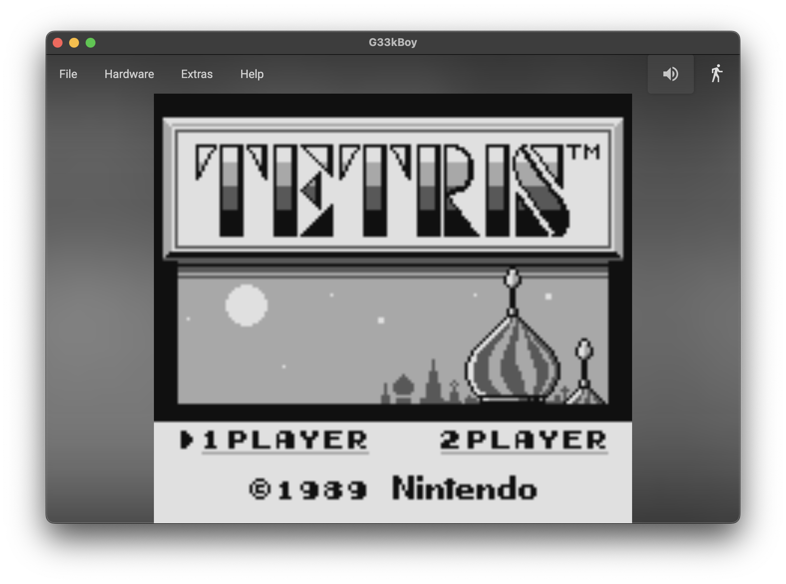
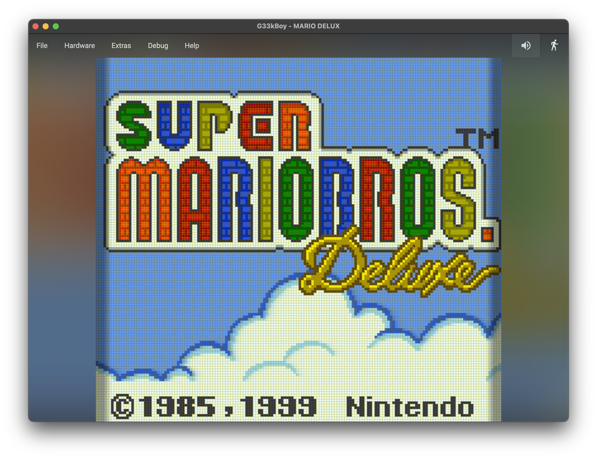

  

# G33kBoy
A cross-platform Avalonia-based Game Boy emulator.

## Classic Game Boy LCD

## Game Boy Color LCD

## Purpose
G33kBoy exists so I can learn Game Boy hardware properly, starting from a clean SM83 CPU implementation.  
My [ZX Spectrum emulator](https://github.com/deanthecoder/ZXSpeculator) taught me a lot about emulation, and the Game Boy has a *similar* CPU – but it also includes a dedicated PPU (video) and sound hardware that need to be emulated too. It is also a playground for some CPU performance techniques I wanted to try.

## Keyboard controls

### Game Boy joypad
Global key hooks translate the following keys into the Game Boy joypad:

  

  | Keyboard       | Joypad |
  |----------------|--------|
  | `Arrow keys`   | D-pad |
  | `Z`            | B |
  | `X`            | A |
  | `A`            | Auto-fire B |
  | `S`            | Auto-fire A |
  | `Space`        | Select |
  | `Enter/Return` | Start |
  

  

### Application shortcuts
- **Open ROM**: `Ctrl+O` (`Cmd+O` on macOS)
- **Start/stop recording**: `Ctrl+M` (`Cmd+M` on macOS)
- **Reset device**: `Ctrl+R` (`Cmd+R` on macOS)
- **Save snapshot**: `Ctrl+S` (`Cmd+S` on macOS)
- **Time travel**: `Backspace`

## Emulator features
- **ROM loading from ZIPs** – Load standard `.gb` and `.gbc` ROMs directly, or from a `.zip` archive containing a Game Boy ROM. Simply drag-and-drop ROM files onto the window.
- **Time travel snapshots** – Preview and roll back recent gameplay with Backspace.
- **On-demand auto-fire** – Enable hardware auto-fire of A and B buttons.
- **Ambient blur background** – Optional blurred background so the Game Boy screen stands out while the app blends into your desktop.
- **Original green display** – Toggle a classic four-shade green palette to mimic the original DMG screen.
- **CGB mode selection** – Choose DMG or CGB mode for dual-compatible cartridges.
- **LCD emulation** – Optional high‑fidelity LCD simulation including pixel‑grid structure, sub‑pixel glow, grain, edge shadowing, and per‑pixel diffusion to closely mimic the look of the original DMG screen.
- **Motion blur** – Blend frames together for a persistence-of-vision effect that smooths fast movement.
- **Screenshot capture** – Save the current frame as a TGA screenshot.
- **Movie recording** – Capture the LCD-filtered output with synced audio to an MP4 file.
- **Snapshot save/load** – Save emulator state to `.sav` files and restore it later.
- **Tile map export** – Export the current tile map as a TGA image for debugging graphics or capturing assets.

## LCD emulation

The Game Boy’s original DMG screen has a distinctive look: soft diffusion, pixel‑grid separation, slight edge‑shadowing, and a subtle shimmer caused by panel grain.  
G33kBoy includes an optional LCD emulation mode that reproduces these characteristics without shaders, using a hand‑tuned software renderer.

**Techniques used:**
- Pixel‑grid outlines for authentic DMG cell structure  
- Per‑pixel grain to simulate panel irregularities  
- Dynamic edge‑shadowing for a recessed‑screen feel  
- Tinted top/bottom/side glow that matches the original greenish bleed

LCD emulation can be toggled at runtime and has very little performance overhead thanks to lookup‑table optimisation.

## Status
- ✔ CPU: full instruction set + automated tests
- ✔ PPU: Scanline-based renderer
- ✔ Boot ROM behaviour
- ✔ Zipped ROM loading
- ✔ 4 Channel Audio
- ✔ Cartridge MBCs
- ✔ Game Boy Color support
- ✔ Gameplay rollback

## Highlights
- **SM83 accuracy** – `DTC.SM83` implements the Game Boy CPU, including interrupt handling, prefixed instructions, memory bus, PPU timing, and a mnemonic disassembler to inspect opcode streams.
- **Shared core utilities** – `DTC.Core` provides reusable commands, extensions, converters, and Avalonia helpers so the emulator and any future UI/drivers share common infrastructure.
- **Shared emulator host** – `DTC.Emulation` is the shared host repo used to write each emulator in this family.
- **Avalonia UI shell** – `G33kBoy` hosts the emulator in a cross-platform desktop window.
- **Validation suite** – `UnitTests` target the CPU core via NUnit, ensuring regressions are caught early.

## External resources
- `external/GameboyCPUTests/` – [CPU tests for regression validation](https://github.com/adtennant/GameboyCPUTests)
- `external/blargg-test-roms/` – [Blargg test ROMs to verify accuracy](https://github.com/retrio/gb-test-roms)
- `external/dmg-acid2.gb` – [The Acid2 test ported to the DMG](https://github.com/mattcurrie/dmg-acid2); useful for visual and timing verification

## Useful links
- [Pan Docs](https://gbdev.io/pandocs/)
- [Game Boy Doctor](https://github.com/robert/gameboy-doctor/)
- [Game Boy Opcode Generator](https://meganesu.github.io/generate-gb-opcodes/)

## Special thanks
- Quality, feedback, and testing – Lavanya
- Artistic input and advice – Sam (aka Doobie)

## License
Licensed under the MIT License. See [LICENSE](LICENSE) for details.
